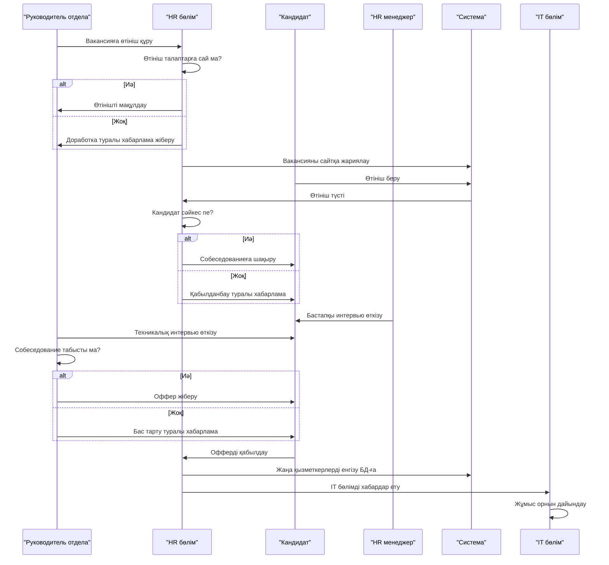

```mermaid
%% Mermaid swimlane simulation using gantt + sections
%% Mermaid толық swimlane қолдамаса да, sequence diagram арқылы ұқсас көрсетуге болады

sequenceDiagram
    participant DeptHead as "Руководитель отдела"
    participant HR as "HR бөлім"
    participant Candidate as "Кандидат"
    participant HRManager as "HR менеджер"
    participant System as "Система"
    participant IT as "IT бөлім"

    DeptHead->>HR: Вакансияға өтініш құру
    HR->>HR: Өтініш талаптарға сай ма?
    alt Иә
        HR->>DeptHead: Өтінішті мақұлдау
    else Жоқ
        HR->>DeptHead: Доработка туралы хабарлама жіберу
    end

    HR->>System: Вакансияны сайтқа жариялау
    Candidate->>System: Өтініш беру
    System->>HR: Өтініш түсті
    HR->>HR: Кандидат сәйкес пе?
    alt Иә
        HR->>Candidate: Собеседованиеға шақыру
    else Жоқ
        HR->>Candidate: Қабылданбау туралы хабарлама
    end

    HRManager->>Candidate: Бастапқы интервью өткізу
    DeptHead->>Candidate: Техникалық интервью өткізу
    DeptHead->>DeptHead: Собеседование табысты ма?
    alt Иә
        DeptHead->>Candidate: Оффер жіберу
    else Жоқ
        DeptHead->>Candidate: Бас тарту туралы хабарлама
    end

    Candidate->>HR: Офферді қабылдау
    HR->>System: Жаңа қызметкерлерді енгізу БД-ға
    HR->>IT: IT бөлімді хабардар ету
    IT->>IT: Жұмыс орнын дайындау

```
