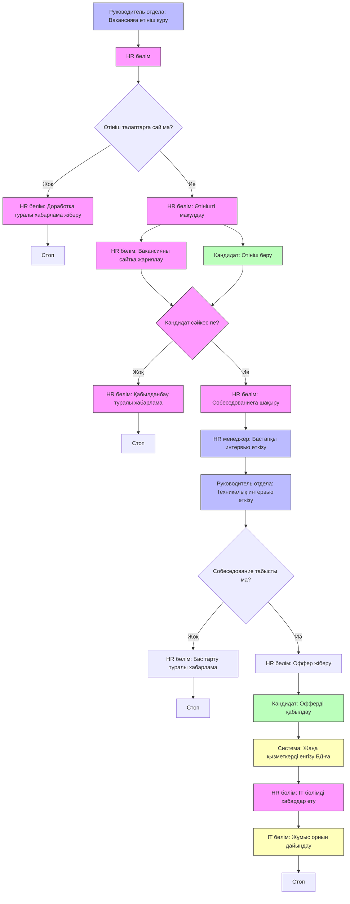

```mermaid
flowchart TD
    %% Руководитель отдела
    A1["Руководитель отдела: Вакансияға өтініш құру"] --> B1["HR бөлім"]

    %% HR бөлім: өтініш тексеру
    B1 --> C1{Өтініш талаптарға сай ма?}
    C1 -- Иә --> D1["HR бөлім: Өтінішті мақұлдау"]
    C1 -- Жоқ --> E1["HR бөлім: Доработка туралы хабарлама жіберу"]
    E1 --> STOP1[Стоп]

    %% Fork: Вакансия жариялау / Кандидат өтініш беру
    D1 --> F1["HR бөлім: Вакансияны сайтқа жариялау"]
    D1 --> G1["Кандидат: Өтініш беру"]

    %% HR бөлім: кандидат тексеру
    F1 & G1 --> H1{Кандидат сәйкес пе?}
    H1 -- Иә --> I1["HR бөлім: Собеседованиеға шақыру"]
    H1 -- Жоқ --> J1["HR бөлім: Қабылданбау туралы хабарлама"]
    J1 --> STOP2[Стоп]

    %% HR менеджер: бастапқы интервью
    I1 --> K1["HR менеджер: Бастапқы интервью өткізу"]

    %% Руководитель отдела: техникалық интервью
    K1 --> L1["Руководитель отдела: Техникалық интервью өткізу"]

    %% Собеседование нәтижесі
    L1 --> M1{Собеседование табысты ма?}
    M1 -- Иә --> N1["HR бөлім: Оффер жіберу"]
    M1 -- Жоқ --> O1["HR бөлім: Бас тарту туралы хабарлама"]
    O1 --> STOP3[Стоп]

    %% Кандидат
    N1 --> P1["Кандидат: Офферді қабылдау"]

    %% Система: жаңа қызметкерді қосу
    P1 --> Q1["Система: Жаңа қызметкерді енгізу БД-ға"]

    %% HR бөлім: IT хабардар ету
    Q1 --> R1["HR бөлім: IT бөлімді хабардар ету"]

    %% IT бөлім: жұмыс орнын дайындау
    R1 --> S1["IT бөлім: Жұмыс орнын дайындау"]
    S1 --> STOP4[Стоп]

    %% Style ұсыныстар (міндетті емес, визуалды жақсарту үшін)
    classDef HR fill:#f9f,stroke:#333,stroke-width:1px;
    classDef Manager fill:#bbf,stroke:#333,stroke-width:1px;
    classDef Candidate fill:#bfb,stroke:#333,stroke-width:1px;
    classDef System fill:#ffb,stroke:#333,stroke-width:1px;
    class B1,D1,E1,F1,H1,I1,J1,R1 HR;
    class A1,K1,L1 Manager;
    class G1,P1 Candidate;
    class Q1,S1 System;

```
