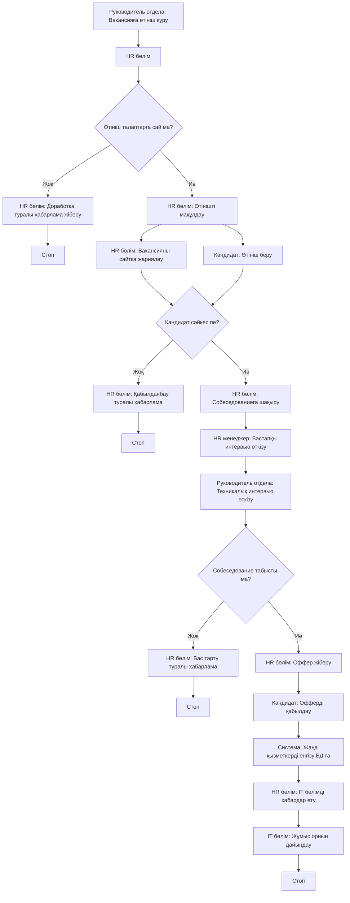

```mermaid
flowchart TD
    %% Swimlanes note ретінде көрсетіледі

    %% Руководитель отдела
    A1["Руководитель отдела: Вакансияға өтініш құру"] --> B1["HR бөлім"]

    %% HR бөлім
    B1 --> C1{Өтініш талаптарға сай ма?}
    C1 -- Иә --> D1["HR бөлім: Өтінішті мақұлдау"]
    C1 -- Жоқ --> E1["HR бөлім: Доработка туралы хабарлама жіберу"]
    E1 --> STOP1[Стоп]

    %% Fork: Вакансия жариялау / Кандидат өтініш беру
    D1 --> F1["HR бөлім: Вакансияны сайтқа жариялау"]
    D1 --> G1["Кандидат: Өтініш беру"]

    %% HR бөлім
    F1 & G1 --> H1{Кандидат сәйкес пе?}
    H1 -- Иә --> I1["HR бөлім: Собеседованиеға шақыру"]
    H1 -- Жоқ --> J1["HR бөлім: Қабылданбау туралы хабарлама"]
    J1 --> STOP2[Стоп]

    %% HR менеджер
    I1 --> K1["HR менеджер: Бастапқы интервью өткізу"]

    %% Руководитель отдела
    K1 --> L1["Руководитель отдела: Техникалық интервью өткізу"]

    %% Сәтті / сәтсіз
    L1 --> M1{Собеседование табысты ма?}
    M1 -- Иә --> N1["HR бөлім: Оффер жіберу"]
    M1 -- Жоқ --> O1["HR бөлім: Бас тарту туралы хабарлама"]
    O1 --> STOP3[Стоп]

    %% Кандидат
    N1 --> P1["Кандидат: Офферді қабылдау"]

    %% Система
    P1 --> Q1["Система: Жаңа қызметкерді енгізу БД-ға"]

    %% HR бөлім
    Q1 --> R1["HR бөлім: IT бөлімді хабардар ету"]

    %% IT бөлім
    R1 --> S1["IT бөлім: Жұмыс орнын дайындау"]
    S1 --> STOP4[Стоп]

```
