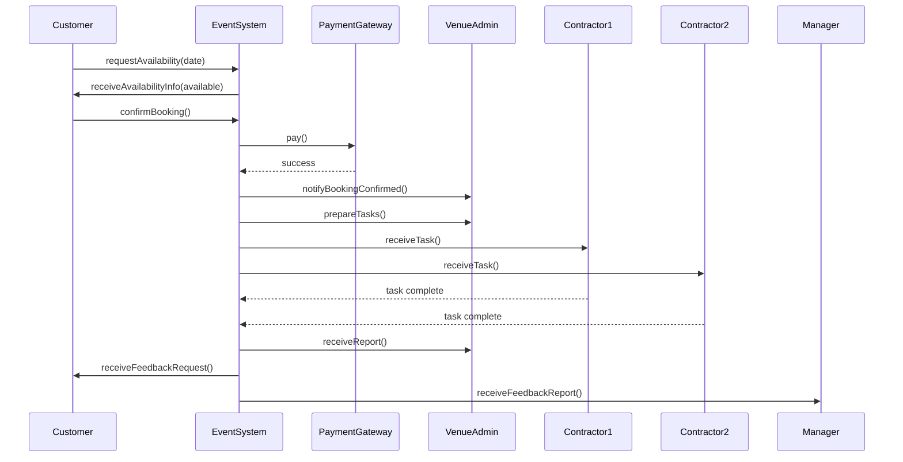

```mermaid
sequenceDiagram
    participant Customer
    participant EventSystem
    participant PaymentGateway
    participant VenueAdmin
    participant Contractor1
    participant Contractor2
    participant Manager

    Customer->>EventSystem: requestAvailability(date)
    EventSystem->>Customer: receiveAvailabilityInfo(available)
    
    Customer->>EventSystem: confirmBooking()
    EventSystem->>PaymentGateway: pay()
    PaymentGateway-->>EventSystem: success
    EventSystem->>VenueAdmin: notifyBookingConfirmed()
    
    EventSystem->>VenueAdmin: prepareTasks()
    EventSystem->>Contractor1: receiveTask()
    EventSystem->>Contractor2: receiveTask()
    Contractor1-->>EventSystem: task complete
    Contractor2-->>EventSystem: task complete
    EventSystem->>VenueAdmin: receiveReport()
    
    EventSystem->>Customer: receiveFeedbackRequest()
    EventSystem->>Manager: receiveFeedbackReport()

```
